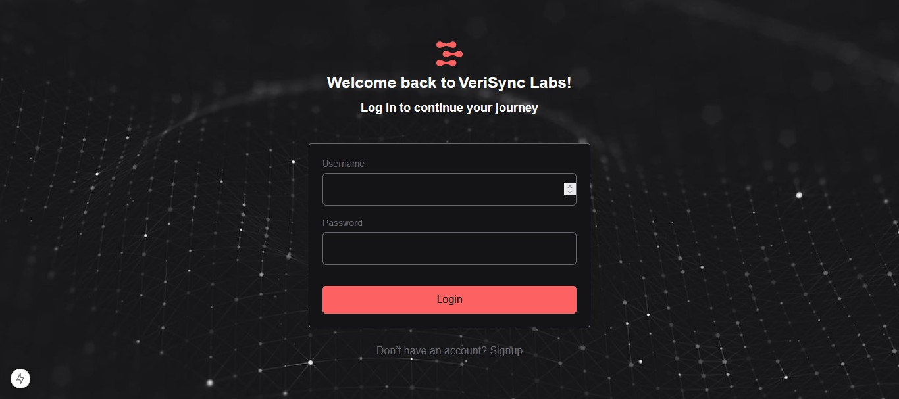

# User Dashboard and ZK-Based Authentication System

This project comprises two main objectives: 

1. **Responsive Dashboard Design** - A responsive interface displaying user data fetched from a mock API.
2. **Implementing a ZK-Based Authentication System** - A front-end authentication system using zkAuth Kit for zero-knowledge proof-based login.

# Endpoints
**/** - dashboard
**/question1** - authentication system

## Screenshots
### User Dashboard

### Modal

### Registration Page

### Login Page

### Mobile Optimization

## Responsive Dashboard Design

### Objectives

Build a responsive dashboard interface that displays a list of user data fetched from a mock API. The dashboard should be visually appealing and adapt to both desktop and mobile views.

### Requirements

1. Fetch a list of users from the API endpoint: 
   [https://jsonplaceholder.typicode.com/users](https://jsonplaceholder.typicode.com/users).
2. Display the user data in a card-based layout on desktop and a single-column list on mobile.
3. Include search functionality to filter users by name or username.
4. Implement sorting options (by name and by username).
5. Add a hover effect on each user card to reveal a "View Details" button.
6. Clicking "View Details" should open a modal showing additional details (e.g., address, phone, website).

### Evaluation Criteria

- Clean, organized, and responsive design.
- Code readability and structure.
- Effective use of CSS frameworks (if any).
- Proper state management and API handling.

---

## Implementing a ZK-Based Authentication System

### Objectives

Develop a front-end authentication system using the provided zkAuth kit to implement a zero-knowledge (ZK) proof-based login.

### Requirements

1. **Registration Flow:**
   - Build a registration page where users can input their desired username and password.
   - Use the `get_pass_hash` function from the provided WASM JS file to generate a hashed password for the entered password.
   - Save the hashed password as part of the simulated backend process.

2. **Login Flow:**
   - Create a login page where users can input their username and password.
   - Call the `generate_proof` function from the provided WASM JS file when users attempt to log in.
   - Send the generated ZK proof along with the username to the simulated backend (stored in local storage).
   - Use the `verify_proof` function in the WASM JS file to check the proof against the hash stored for the user in the backend. Display an alert indicating whether the login is successful or failed based on verification.
